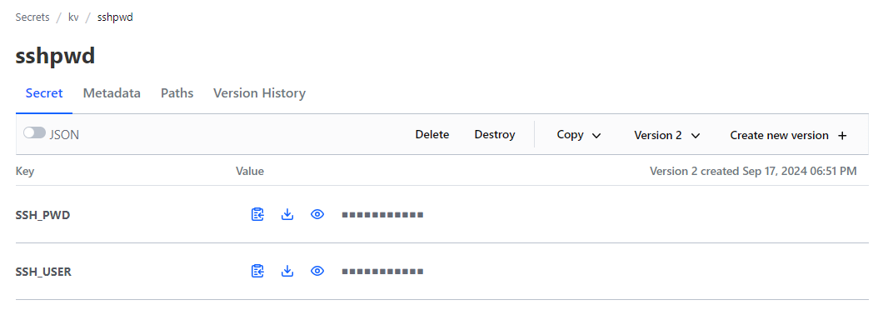

Ansible:

# why better than shell scripting:

1. it is declrative 
2. it is heterogenous -> ansible code can execute and provide us the output on all flavours of linux
3. at scale, this works well.
4. we can parallely confige n no of servers without logging into them.
5. the script doesnt required to be locally stored on all servers.
6. Agentless - there is no need of Agent on every servers.
7. Ansible works on SSH.

## Ansible push  - pushing from 1 base machine to all other servers
## Ansible pull - servers pulling from github (this is appicable for dynamic scaling infrastcuture.)

so what do we need to make sure that ansible works without any issues:

1. common creditials across all the servers to make sure that ansible can use same set of creds for every server.
2. make sure to ansible server can communicate to all the servers that needs configuation management.

backend of ansible is python which means that we have to install python inorder to use the python

to see the python version just start python using the command. -> python --version shows the current intalled python version.

PIP -> is the python package manager. 

sudo pip3.11 install ansible {for specific pyhton version virtual environment} or sudo dnf install ansible {for installing the ansible from the configured repo}

Pypi - go to google pyhton package index and search for ansible where you will see the latest ansible version and also the pre-requesities for the ansible.

Ansible core and ansible

ansible core 02.17 means ansible 10 version 

rpm -qa | grep python - to see the version of python that are installed and every installed version of python will have its own command exmaple python - default intrpretuer taken by the system, python3.11 , python3.12 so each version will have its own command with version number. 

we can change the default intrepter of the python command to over required version.

# see more on this:

Creating and Using Virtual Environments:

If you're working with multiple Python versions, using virtual environments can help:

-----------------------------------------------------------------------------------------------------------------------------------

# Ansible inventory:

Ansible inventory contains all the servers for which we are going to do configuaration management.

we can even send any commands to node servers and get the results either manually( sending 1 command at a time ) or by automatic (playbook: instruction return in yaml language) -> playbook are waht we use for configuration management mostly.

### Ansible modules (upto ansible 2.9) and collections (terminology from 2.9 to present and future.)

Ansible Modules: Similar to Python libraries, they extend functionality and perform specific actions within Ansible playbooks. Each module provides a way to manage different aspects of system configuration and automation.

-----------------------------------------------------------------------------------------------------------------------------

# how to invoke ansible for now we try to execute the a simple commands to see if its works

'''''''''

ansible -i nodes all -e ansible_user=ec2-user -e ansible_password=DevOps321 -m ansible.builtin.shell -a uptime

'''''''''
ansible: This is the command-line tool for running ad-hoc commands with Ansible.

[-i nodes]: This specifies the inventory file named nodes which contains the list of hosts or groups of hosts where the command will be executed.

[all]: This tells Ansible to run the command on all hosts listed in the inventory file.

[-e ansible_user=ec2-user]: This sets an extra variable ansible_user to ec2-user. It tells Ansible which user account to use for connecting to the remote hosts.

[-e ansible_password=DevOps321]: This sets an extra variable ansible_password to DevOps321. It specifies the password for the user account on the remote hosts.

[-m ansible.builtin.shell]: This specifies the module to use, in this case, ansible.builtin.shell. The shell module allows you to run shell commands on the remote hosts.

[-a uptime]: This provides the argument to the shell module, specifying the command uptime that you want to run on the remote hosts. The uptime command shows how long the system has been running and other related information.

but we wont be using the above as these are manual execution of commands -> now, we use the concept of playbook for automation of configuration management.

### Inventory

Inventory is where groups are present. so we group certain server into a group based upon application installed on them or their functionality we group them in a way where configuaration management is similar on certain amount of VMs.

[frontend] this is how we declare a group in a inventory file 
ipadresses

[backen]
ipadresses

there is another group call all where all the servers mentioned in the inventory file will considered when executing the ansible commands.

ansible -i nodes all [instaed of mentioning all we can specify the group name like frontend, backend etc so that specific configuration will be done on specific VMs] -e ansible_user=ec2-user -e ansible_password=DevOps321 -m ansible.builtin.shell -a uptime

## What is a Playbook

Playbook are list of plays
plays are list of tasks
tasks are actionable items.

Playbook are the way to ansible automation script. 
we have to know YAML language to write this playbook. lplaybook are scripted in YAML language.

no 2 tasks in a play have same name and no two plays in a playbook have the same name.

## How to execute/run a playbook

ansible-playbook -i nodes [just the inventory name groups will be provided in the hosts paramter in the yaml] -e ansible_username=ec2-user -e ansible_password=DevOps321 ping-playbook.yaml [playbook name]

play -i nodes -e ansible_user=ec2-user -e ansible_password=DevOps321 shell.yaml

Ansible always gather facts before executing the plays to know the current status of the VM. so, we can disable the gathering facts option to save time.

Ansible vault - used to encrypt and keep files secure. 

## error-handling

by default the task are dependent on each other means the playbook is executed from top-bottom if there are no special conditions. plays are executed from top-bottom if there are no special conditions, the tasks in the plays are executed from top-bottom if there are no special conditions so if there is any error with the task the subsequent tasks will not be executed.

but lets say we have a scenario where the installation of some applications doesn't have dependencies on one another.

then if a task fail the subsequent task should be executed. so to acheieve that we use ignore_errors: true/yes etc.

### important:

> gather_facts: false # by default this will be true. if kept to false then ansible dont gather facts before executing the play.
> ignore_errors: True # by this if there is any error the task execution will be ignored and move on to the another task.
> ansible.builtin.shell: ps -ef | grep java | grep -v grep 
> ansible.builtin.shell: uptime
    register: sheout # this is a varaible where the output of the command execution lies.

variables: 

tags are important concept. by using tags we can execute a certain no of if tasks instead of whole playbook play and tasks.

so tags are given at play level and task level: so if a play and task in another play has same tag then, entire play and that specifc task of other will get executed.

## Ansible roles:

Ansible playbooks are just some scripts which doesnt carry any dependecies. for example, lets ssay there is a file that should be copied a user doesn't know if the file/object is related to a playbook.

By using roles, you can encapsulate related tasks and configurations into reusable units, making your playbooks cleaner and more maintainable. You can also share roles with others or use roles created by the community, which can help you avoid reinventing the wheel.

roles/
    common/               # this hierarchy represents a "role"
        tasks/            #
            main.yml      #  <-- tasks file can include smaller files if warranted
        handlers/         #
            main.yml      #  <-- handlers file
        templates/        #  <-- files for use with the template resource
            ntp.conf.j2   #  <------- templates end in .j2
        files/            #
            bar.txt       #  <-- files for use with the copy resource
            foo.sh        #  <-- script files for use with the script resource
        vars/             #
            main.yml      #  <-- variables associated with this role
        defaults/         #
            main.yml      #  <-- default lower priority variables for this role
        meta/             #
            main.yml      #  <-- role dependencies
        library/          # roles can also include custom modules
        module_utils/     # roles can also include custom module_utils
        lookup_plugins/   # or other types of plugins, like lookup in this case

    webtier/              # same kind of structure as "common" was above, done for the webtier role
    monitoring/           # ""
    fooapp/               # ""

so, we have ansible provided modules to which we dont need to check the dependices as ansible will take care of them.
but modules which are provided by community we have to check the pre-reqs and dependencies 

copy module and template module. how do we use.

copy module just copies the file copy - paste
but using the template module -> We can paramterize the file instead of hard coding the values. we can use variables in the roles to change the contents of the file.

<!-- - name: Template a file, using symbolic modes (equivalent to 0644)
  ansible.builtin.template:
    src: /mytemplates/foo.service --> this foo file can have variables in the file which is dyanmic
    dest: /etc/file.conf --> when we use this module instead of file path we have to use template path under the roles.

<!-- [Unit]
Description = Backend Service

[Service]
User={{USER}} - here in the foo.service file i can include a variable and this variable is declared in the vars path of the role.
Environment=DB_HOST="localhost"
ExecStart=/bin/node /app/index.js
SyslogIdentifier=backend

[Install]
WantedBy=multi-user.target -->

- name: Run tasks/other.yaml instead of 'main'
  ansible.builtin.include_role:
    name: myrole
    tasks_from: other

- name: Apply tags to tasks within included file
  ansible.builtin.include_role:
    name: install
    apply:
      tags:
        - install
  tags:
    - always

## how can we create a role dependcy:

we achieve this by using the meta path of the roles where the other role tasks/main.yml should be executed first before the current role main.yml
so we want to create the meta path for roles which has dependencies on other roles.

for example i have created the meta path in backend meta/tasks/main.yml

dependencies:
    - role: rolename 

see the usage of when paramter.

# Ansible Pull:

but theres a catch for this, the node system should have ansible installed to execute ansible pull.

## Ansible push vs pull:

we use push when the infra is static. we have a ansible controller through which we push to other nodes

we use pull when infra is dyanmic (when scaling is used for infra managemnet based on load)

"Companies maintain their own AMI". so in this ansible pull case - we must make sure the pyhton version and ansible as part of AMI. to save time that is required to install ansible.

### how to use ansible pull:

 ansible-pull -U urltothegitrepo -e anyexternalparameters playbookname.yml

 Wxample: ansible-pull -U https://github.com/Pbgopinadh/linux.git -e COMPONENT=frontend/backend/database roleuse.yaml

 the playbook name should be in the repo that we mention in -U. it is going to pull and run the playbook based on the name. also the playbook consists of roles and those roles can be varaiblzed/parameterized and have role depenceies.

 so ansible pull is very powerful mechanism 

 but when using the ansible pull - we should make sure that the hosts: localhost as the changes should the node itself in the playbook.

----------------------------------------------------------------------------------------------------------------------------------------------------------------------------------------

## how to use vault in Ansible

- name: Reading secrets from vault 
  hosts: localhost 
  tasks: 
    - name: Connect to Vault using TLS
      ansible.builtin.debug:
        msg: "Psw is {{secrets.MYSQL_PASS}}"
      vars:
        secrets: "{{ lookup('community.hashi_vault.hashi_vault', 'secret=expense-dev/data/backend token={{token}} url=https://vault.expense.internal:8200 validate_certs=False') }}"

we have to install the HVAC library inorder to use the lookup plugin.

lookup is a plugin that will search for the secrets in a vault.

secret = path to the secrets
token = root token to access the vault
url = url of the vault VM with port
vaildate_certs=false as we the certifcate vaildation will fail. we said ansible to not validate the certificates.

for the above image the path to retrieve the secrets will be kv/data/sshpwd and this is how we retrieve the passowrds {{secrets.MYSQL_PASS}}